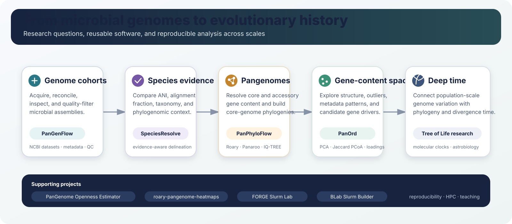

# Muhammad Bilal

### Doctoral Researcher in Microbial Evolutionary Genomics

**Battistuzzi Lab · Oakland University · Michigan, USA**

Microbial pangenomics · phylogenomics · molecular clocks · astrobiology · reproducible bioinformatics

## Research profile

I am a doctoral researcher in the **Biological and Biomedical Sciences PhD program at Oakland University**, working in the [Battistuzzi Lab](https://www.oakland.edu/biology/directory/battistuzzi/). My research asks how microbial genomes diversify across populations and deep evolutionary time, and how analytical choices in pangenomics influence the evolutionary histories we reconstruct.

My current work combines **population-scale pangenomics, core and accessory genome analysis, phylogenomics, and molecular-clock inference**. I am particularly interested in connecting genome variation with the microbial Tree of Life and with questions about ancient and extreme life that are relevant to astrobiology.

I also build reproducible research software and teaching tools so that genome-scale analyses are easier to inspect, test, and reuse.

  

## Current research

### Population-scale pangenome phylogenomics

My doctoral research examines how pangenome construction choices, core-gene definitions, taxonomic sampling, and genome diversity affect microbial phylogenetic reconstruction. The broader goal is to connect population-level genome variation with deeper evolutionary relationships across prokaryotes.

### Molecular clocks and deep time

I use phylogenomic alignments and divergence-time methods to study evolutionary timing across microbial lineages. This includes evaluating how genome sampling and marker selection influence time-calibrated evolutionary hypotheses.

### Astrobiology and extreme life

A parallel research direction explores how microbial evolutionary history, extremophile biology, and genomic signatures can inform questions about ancient life, environmental resilience, and biosignature interpretation.

## Research software

These projects form the main public software ecosystem I am developing around microbial comparative genomics.

<table>
<tr>
<td width="50%" valign="top">

### [PanGenFlow](https://github.com/mbilal-OU/PanGenFlow)

A genome cohort curation toolkit for NCBI microbial assemblies. It supports genome retrieval, GCA/GCF assembly-record reconciliation, metadata extraction, quality filtering, and optional close-genome relatedness checks.

**Focus:** genome acquisition and curation

</td>
<td width="50%" valign="top">

### [SpeciesResolve](https://github.com/mbilal-OU/Genomic-Species-Delineation-Framework)

An evidence-aware framework for microbial species delineation using ANI, alignment fraction, genome quality, GTDB taxonomic context, dereplication, and phylogenomic evidence.

**Focus:** species-boundary evidence

</td>
</tr>
<tr>
<td width="50%" valign="top">

### [PanPhyloFlow](https://github.com/mbilal-OU/PanPhyloFlow)

A reproducible Nextflow workflow for microbial gene-family pangenomics and core-genome phylogenomics. Roary is the default pangenome engine, with Panaroo available as an alternative route.

**Focus:** pangenome to phylogeny

</td>
<td width="50%" valign="top">

### [PanOrd](https://github.com/mbilal-OU/PanOrd)

An ordination workbench for microbial pangenome presence/absence matrices using PCA, Jaccard PCoA, metadata-aware visualization, and gene-cluster loadings.

**Focus:** genome-level gene-content structure

</td>
</tr>
</table>

### Additional tools and teaching projects

| Project | Purpose |
|---|---|
| [PanGenome Openness Estimator](https://github.com/mbilal-OU/PanGenome-Openness-Estimator) | Heaps' law, genome accumulation curves, and permutation-based pangenome openness analysis |
| [roary-pangenome-heatmaps](https://github.com/mbilal-OU/roary-pangenome-heatmaps) | Static and interactive visualization of Roary gene presence/absence data |
| [FORGE Slurm Lab](https://github.com/mbilal-OU/FORGE-Slurm-Lab) | Interactive learning resources for Slurm, modules, Conda, and HPC workflows |
| [BLab Slurm Builder](https://github.com/mbilal-OU/BLab-slurm-builder) | A lightweight helper for composing Slurm job scripts |
| [Rosalind Bioinformatics](https://github.com/mbilal-OU/Rosalind-Bioinformatics) | Algorithmic bioinformatics problem solving and reproducible code examples |

## 2026 research highlights

**AbGradCon 2026, oral presentation accepted**  
*Reconstructing the Microbial Tree of Life Using Population-Scale Pangenome Phylogenomics*  
University of Arizona, Tucson · September 14-18, 2026

**AbSciCon 2026, poster presentation**  
[*Reconstructing the Microbial Tree of Life Using Population-Scale Pangenome Phylogenomics*](https://essopenarchive.org/doi/abs/10.22541/essoar.15003585)  
Madison, Wisconsin · May 18, 2026

**Graduate Research Conference, Oakland University**  
Oral presentation on population-scale pangenome phylogenomics and microbial Tree of Life reconstruction

## Selected recognition

**Provost Graduate Student Research Award, Oakland University, Winter 2026**  
$1,500 research award for *Assessing the Impact of Population-Scale Pangenome Choices on Microbial Phylogenies*

**Sigma Xi Travel Award, 2026**  
Travel support for presenting research at AbSciCon 2026

## Selected publications

1. **Bilal, M., & Battistuzzi, F. U. (2026).** [Pangenomes: Unveiling Genetic Diversity Across Populations and Beyond](https://doi.org/10.1016/B978-0-443-15750-9.00139-7). *Encyclopedia of Evolutionary Biology*, 2nd edition, Vol. 2, 294-306. Elsevier.

2. **Kanwal, M., Basheer, A., Bilal, M., et al. (2024).** [In silico vaccine design for *Yersinia enterocolitica*: A comprehensive approach to enhanced immunogenicity, efficacy, and protection](https://doi.org/10.1016/j.intimp.2024.113241). *International Immunopharmacology*, 143, 113241.

[Google Scholar profile](https://scholar.google.com/citations?user=nQycrykAAAAJ&hl=en)

## Research toolkit

| Area | Tools and methods |
|---|---|
| Pangenomics | Roary, Panaroo, PIRATE, PPanGGOLiN, gene presence/absence analysis |
| Phylogenomics | IQ-TREE, MAFFT, MUSCLE, core-gene concatenation, model selection |
| Molecular clocks | MCMCTree, RelTime, divergence-time calibration |
| Genome comparison | FastANI, GTDB-Tk, dRep, CheckM2 |
| Programming | Python, R, Bash, Linux |
| Reproducible workflows | Nextflow, Snakemake, Conda, GitHub Actions |
| HPC | Slurm, array jobs, large-scale genome analysis |
| Visualization | Matplotlib, ggplot2, ggtree, iTOL, interactive HTML reporting |

## Teaching and leadership

I serve as a graduate assistant at Oakland University and have taught laboratory courses in genetics and introductory biology. My teaching emphasizes experimental reasoning, clear data interpretation, and reproducible computational analysis.

I also serve as **President of the Association of Graduate and Professional Students at Oakland University for 2026-27** and have contributed to graduate training activities through the NSF NRT DAMOS program in data analytics and multi-omics science.

## Education

**PhD, Biological and Biomedical Sciences**  
Oakland University, Michigan, USA · in progress

**MPhil, Biotechnology**  
University of Sargodha, Pakistan · 2021-2023

**BS, Biotechnology**  
University of Sargodha, Pakistan · 2017-2021

## Research interests

`microbial evolution` `pangenomics` `phylogenomics` `molecular clocks` `Tree of Life` `extremophiles` `astrobiology` `comparative genomics` `reproducible bioinformatics` `HPC`

## Connect

I am interested in collaborations involving microbial pangenomics, genome evolution, phylogenomics, molecular clocks, astrobiology, and reproducible computational biology.

**Email:** [mbilal@oakland.edu](mailto:mbilal@oakland.edu)  
**Google Scholar:** [scholar.google.com/citations?user=nQycrykAAAAJ](https://scholar.google.com/citations?user=nQycrykAAAAJ&hl=en)  
**LinkedIn:** [linkedin.com/in/itsmbilal88](https://www.linkedin.com/in/itsmbilal88)  
**GitHub:** [github.com/mbilal-OU](https://github.com/mbilal-OU)
